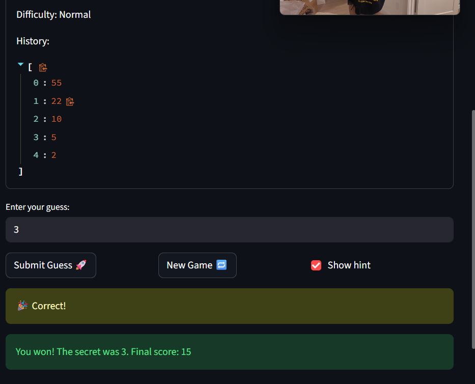

# 🎮 Game Glitch Investigator: The Impossible Guesser

## 🚨 The Situation

You asked an AI to build a simple "Number Guessing Game" using Streamlit.
It wrote the code, ran away, and now the game is unplayable. 

- You can't win.
- The hints lie to you.
- The secret number seems to have commitment issues.

## 🛠️ Setup

1. Install dependencies: `pip install -r requirements.txt`
2. Run the broken app: `python -m streamlit run app.py`

## 🕵️‍♂️ Your Mission

1. **Play the game.** Open the "Developer Debug Info" tab in the app to see the secret number. Try to win.
2. **Find the State Bug.** Why does the secret number change every time you click "Submit"? Ask ChatGPT: *"How do I keep a variable from resetting in Streamlit when I click a button?"*
3. **Fix the Logic.** The hints ("Higher/Lower") are wrong. Fix them.
4. **Refactor & Test.** - Move the logic into `logic_utils.py`.
   - Run `pytest` in your terminal.
   - Keep fixing until all tests pass!

## 📝 Document Your Experience

- [ ] Describe the game's purpose.

This project is a debugging exercise for an AI-generated number guessing game built with Streamlit.The goal of the game is for the player to guess a secret number within a limited number of attempts.The project focuses on identifying bugs in AI-generated code, fixing the logic errors, and verifying the fixes through testing.

- [ ] Detail which bugs you found.

Several bugs were discovered while running the game:

• The hint logic was reversed, causing the game to say “Go HIGHER” when the guess was already higher than the secret number.  
• The game allowed decimal guesses like 31.5 and converted them into integers instead of rejecting them.  
• The secret number was sometimes converted to a string, which caused a TypeError when Python tried to compare an integer guess with a string value.

- [ ] Explain what fixes you applied.

To fix these issues, the core game logic was refactored into logic_utils.py so that the Streamlit UI and game logic were separated. The check_guess function was corrected so  that the hint direction matches the actual comparison between the guess and the secret number. The parse_guess function was updated to only allow integer inputs. The bug that converted the secret number into a string was removed so comparisons always occur between integers. Automated tests using pytest were added to verify the guessing logic works correctly.

## 📸 Demo

## 🚀 Stretch Features

- [ ] [If you choose to complete Challenge 4, insert a screenshot of your Enhanced Game UI here]
